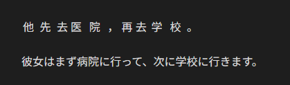

# Obsidian Zhongwen Block

中国語学習者向けの機能を備えたコードブロックを提供する Obsidian プラグイン

`zh-cn` コードブロック内の各中国語文は、対応するピンインをルビとして付与したうえで表示されます。

`zh-hk` コードブロック内の各中国語文は、対応する粤拼（jyutping）をルビとして付与したうえで表示されます。

発音を覚えるのを促すために、ピンイン/粤拼は中国語文にマウスホバーしている間だけ表示されます。


編集ビュー:

````markdown
```zh-cn
他先去医院，再去学校。
```

彼女はまず病院に行って、次に学校に行きます。
````

リーディングビュー:

(デフォルト)



(マウスホバー時)


## 設定

### 言語

デフォルト値: English

このプラグインでは、英語と日本語に対応しています。

### ピンインを常に表示する

デフォルト値: `false`

`true` の場合、最初からピンインが表示された状態になります。


## 帰属

- 中国語からピンインに変換するために、[pinyin-pro](https://github.com/zh-lx/pinyin-pro) を利用しています。
- 中国語から粤拼に変換するために、[to-jyutping](https://github.com/CanCLID/to-jyutping) を利用しています。

[](https://app.fossa.com/projects/git%2Bgithub.com%2F0918nobita%2Fobsidian-zhongwen-block?ref=badge_large&issueType=license)

## 開発

## 依存パッケージのインストール

```bash
$ bun i
```

### ビルド

```bash
$ bun run build
```

### Lint

```bash
$ bun run lint
```

### ソースコードをフォーマットする

```bash
$ bun run format
```

### テスト

```bash
$ bun test
```
