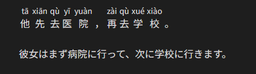

# Obsidian Zhongwen Block

中国語学習者向けの機能を備えたコードブロックを提供する Obsidian プラグイン

`zh-cn` コードブロック内の各中国語文は、対応するピンインをルビとして付与したうえで表示されます。

発音を覚えるのを促すために、ピンインは中国語文にマウスホバーしている間だけ表示されます。


編集ビュー:

````markdown
```zh-cn
他先去医院，再去学校。
```

彼女はまず病院に行って、次に学校に行きます。
````

リーディングビュー:

(デフォルト)


(マウスホバー時)



## 設定

### Always show pinyin

デフォルト値: `false`

`true` の場合、最初からピンインが表示された状態になります。

## 帰属

-   中国語からピンインに変換するために、[pinyin-pro](https://github.com/zh-lx/pinyin-pro) を利用しています。

## 開発

### ビルド

```bash
$ npm run build
```

### Lint

```bash
$ npm run lint
```

### ソースコードをフォーマットする

```bash
$ npm run format
```
