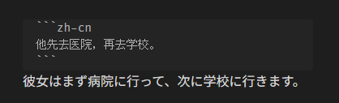
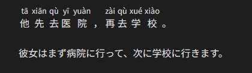

# Obsidian Zhongwen Block

An Obsidian plugin which provides code blocks with features for Chinese learners

Each Chinese sentence in `zh-cn` code block will be annotated with corresponding pinyin as ruby.

In order to help you remember the pronunciation, each pinyin is displayed only while the Chinese sentence is hovered.

Editing view:



Reading view:

| Default                                                    | Hovered                                                    |
| ---------------------------------------------------------- | ---------------------------------------------------------- |
|  |  |

## Development

### Build

```bash
$ npm run build
```

### Lint

```bash
$ npm run lint
```

### Format

```bash
$ npm run format
```
