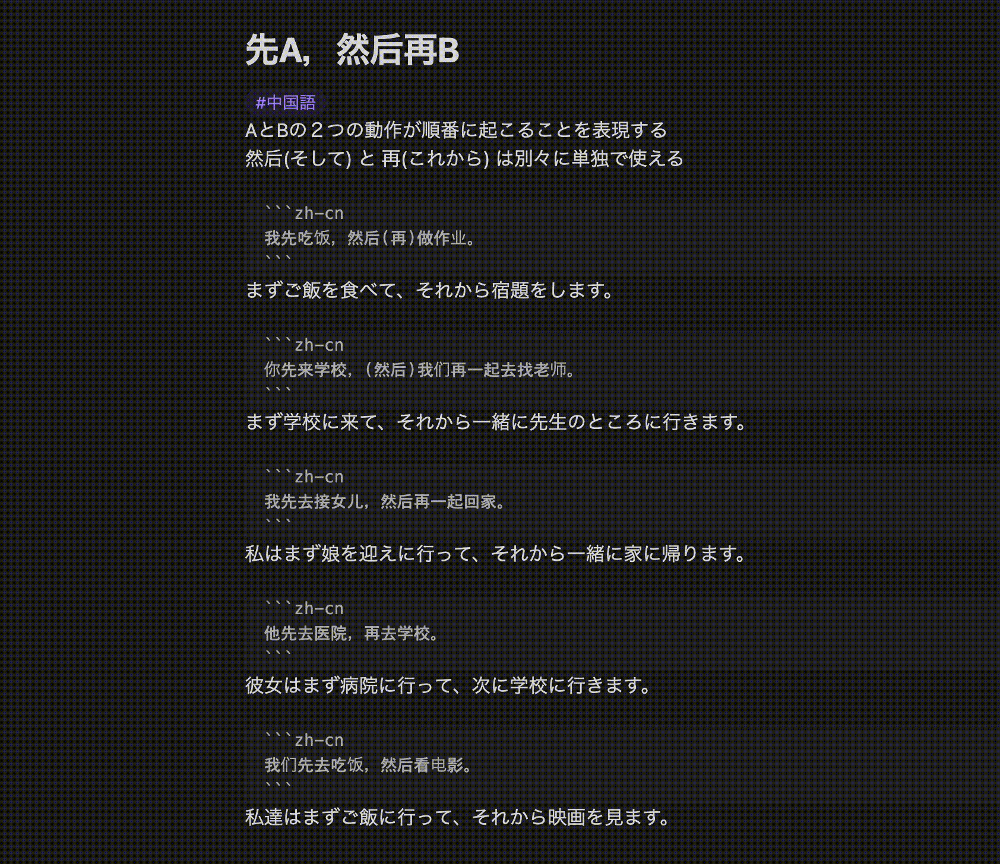
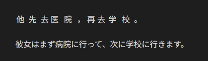
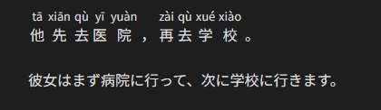

# Obsidian Zhongwen Block

An Obsidian plugin which provides code blocks with features for Chinese learners

Each Chinese sentence in `zh-cn` code block will be annotated with corresponding pinyin as ruby.

In order to help you remember the pronunciation, each pinyin is displayed only while the Chinese sentence is hovered.



Editing view:

````markdown
```zh-cn
他先去医院，再去学校。
```

彼女はまず病院に行って、次に学校に行きます。
````

Reading view:

(Default)



(On hover)



## Settings

### Always show pinyin

Default: `false`

When `true`, each pinyin will be displayed from the beginning.

## Attribution

-   Zhongwen Block depends on [pinyin-pro](https://github.com/zh-lx/pinyin-pro) in order to convert Chinese into pinyin.

## Development

### Build

```bash
$ npm run build
```

### Lint

```bash
$ npm run lint
```

### Format

```bash
$ npm run format
```
